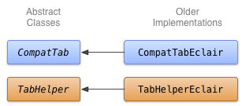

# 使用旧的APIs实现新API的效果

> 编写: [spencer198711](https://github.com/spencer198711) - 原文:

这一课讨论了如何创建一个支持旧的设备并且与新的APIs接口相同的实现。

## 决定一个替代方案

在以向后兼容的方式使用较新的UI功能的时候，最具挑战的任务是为旧的平台版本决定一个解决方案。在很多情况下，使用旧的UI框架中的功能是有可能完成这些新的UI组件的。例如：

* Action Bar可以使用水平的包含图片按钮的LinearLayout来实现，这个在Activity中的LinearLayout作为自定义标题栏或者仅仅作为视图。下拉功能行为可以使用设备的菜单按钮来实现。
* Action Bar的tab页可以使用包含按钮的水平的LinearLayout，或者使用[TabWidget](http://developer.android.com/reference/android/widget/TabWidget.html)UI控件来实现。
* [NumberPicker](http://developer.android.com/reference/android/widget/NumberPicker.html)和[Switch](http://developer.android.com/reference/android/widget/Switch.html)控件可以分别通过使用[Spinner](http://developer.android.com/reference/android/widget/Spinner.html)和[ToggleButton](http://developer.android.com/reference/android/widget/ToggleButton.html)控件来实现。
* [ListPopupWindow](http://developer.android.com/reference/android/widget/ListPopupWindow.html)和[PopupMenu](http://developer.android.com/reference/android/widget/PopupMenu.html)控件可以通过使用[PopupWindow](http://developer.android.com/reference/android/widget/PopupWindow.html)来实现。

为了往老的设备上向后移植UI组件，这些一般不是一刀切的解决方案。注意用户体验：在老的设备上，用户可能不熟悉新的界面设计模式和UI组件，思考一下如何使用熟悉的控件去实现相同的功能。在很多种情况下，这些通常不会被注意到，特别是在如果新的UI组件在应用程序的生态系统中是突出的（比如Action Bar），或者交互模型是非常简单和直观的(比如使用[ViewPager](http://developer.android.com/reference/android/support/v4/view/ViewPager.html)去滑动界面)。

## 使用旧的APIs实现Tabs

你可以使用[TabWidget](http://developer.android.com/reference/android/widget/TabWidget.html)和[TabHost](http://developer.android.com/reference/android/widget/TabHost.html)（尽管其中一个也可以使用水平方向的Button控件）去创建Action Bar Tabs的老的实现。可以在TabHelperEclair和CompatTabEclair的类中去实现，因为这些实现使用了不迟于Android 2.0（Eclair）的APIs。



* Figure 1. Eclair版本上实现tabs的类图

CompatTabEclair在实例变量中保存了诸如tab文本和tab图标等tab属性，因为在老的版本中没有ActionBar.Tab对象去处理这些数据存储。

```java
public class CompatTabEclair extends CompatTab {
    // Store these properties in the instance,
    // as there is no ActionBar.Tab object.
    private CharSequence mText;
    ...

    public CompatTab setText(int resId) {
        // Our older implementation simply stores this
        // information in the object instance.
        mText = mActivity.getResources().getText(resId);
        return this;
    }

    ...
    // Do the same for other properties (icon, callback, etc.)
}
```

TabHelperEclair利用了TabHost控件的方法去创建[TabHost.TabSpec](http://developer.android.com/reference/android/widget/TabHost.TabSpec.html)对象和tab的页面指示效果：

```java
public class TabHelperEclair extends TabHelper {
    private TabHost mTabHost;
    ...

    protected void setUp() {
        if (mTabHost == null) {
            // Our activity layout for pre-Honeycomb devices
            // must contain a TabHost.
            mTabHost = (TabHost) mActivity.findViewById(
                    android.R.id.tabhost);
            mTabHost.setup();
        }
    }

    public void addTab(CompatTab tab) {
        ...
        TabSpec spec = mTabHost
                .newTabSpec(tag)
                .setIndicator(tab.getText()); // And optional icon
        ...
        mTabHost.addTab(spec);
    }

    // The other important method, newTab() is part of
    // the base implementation.
}
```

现在你已经有了两种CompatTab和TabHelper的实现，一种是使用了新的APIs为了能够在Android 3.0或其后版本设备上能够运行，另一种则是使用了旧的APIs为了在Android 2.0或之前的设备上能够运行。下一课讨论在应用中使用这两种实现。
