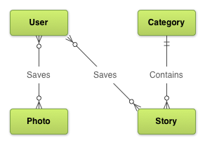

# 规划界面和他们之间的关系

> 编写:[XizhiXu](https://github.com/XizhiXu) - 原文:<http://developer.android.com/training/design-navigation/screen-planning.html>

多数 App 都有一种内在的信息模型，它能被表示成一个对象类型的树或图。更浅显的说，你可以画一个有不同类型信息的图，这些信息代表用户在你 App 里与之互动的各种东西。软件工程师和数据架构师经常使用实例-关系图（Entity-Relationship Diagram，ERD）描述一个应用的信息模型。

让我们考虑一个让用户浏览一群分类好的新闻事件和图片的应用例子。这种 App 一个可能的模型如下 ERD 图。

## 创建一个界面列表

一旦你定义了信息模型，你就可以开始定义那些使用户在你的 App  中有效地发掘，查看和操作数据的上下文环境了。实际上，一种方法就是确定供用户导航和交互数据所需的 *界面完备集*（归纳了所有界面的集合）。但我们实际发现的画面集合应该根据目标设备变化。在设计过程中早点考虑到这点很重要，这样可以保证程序可以适应运行环境。

在我们的例子中，我们想让用户**查看**，**保存**和**分享**分类好了的**新闻**和**图片**。下面是涵盖了这些用例的画面完备列表。

* 用来接触新闻和图片的 Home 或者 Launchpad 画面
* 类别列表
* 某个分类下新新闻列表
* 新闻详细信息 View （在这里面我们可以保存和分享）
* 图片列表，不分类
* 图片详细信息 View （在这里面我们可以保存和分享）
* 所有保存项列表
* 图片保存列表
* 新闻保存列表

## 图示界面关系

现在我们可以定义界面间的有向关系了。一个从界面 *A* 指向另一个界面 *B* 的箭头表示通过用户在画面 *A* 的某个交互动作可直达画面 *B* 。一旦我们定义了界面集和他们之间的关系，我们可以将他们一起全部表示在一张界面图中了：

如果之后我们想允许用户提交新闻事件或者上传图片，我们可以在图中加额外的界面。

## 脱离简陋设计

就此，我们有希望根据这张完备的界面图设计一个功能完备应用。一个简陋的 UI 可以由列表和导向子画面的按钮组成。

* 导向不同部分的按钮（例如，事件，图片，保存的项目）
* 纵向列表表示集合（例如，事件列表，图片列表，等等）
* 详细信息（例如，事件 View ，图片 View ，等等）

但是，你可以利用屏幕组合技术和更高深导航元件以一种更直观，设备更理解的方式呈现内容。下节课，我们探索屏幕组合技术，比如为平板而生的多视窗（Multi-pane）布局。之后，我将深入讲解更多不同的 Android 常见导航模式。

[下节课：规划多种触屏大小](multi-sizes.html)
